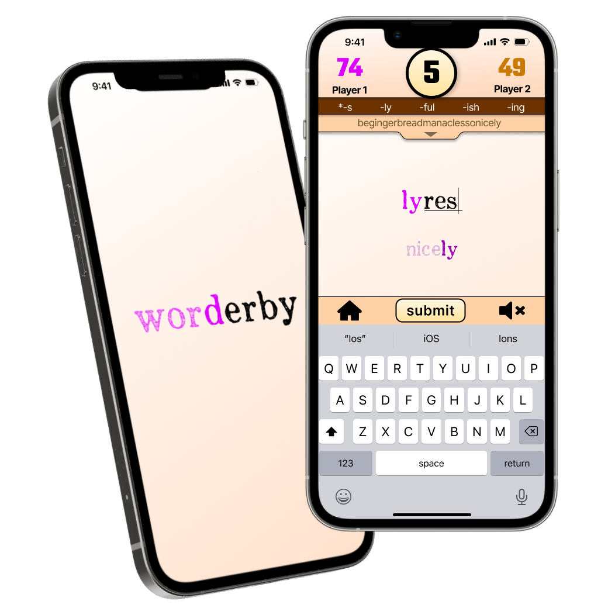

<a href="https://youtu.be/MjrI8v3S0LU">

  

</a>
<h1>Click Image for Demo Video</h1>

# Worderby

Worderby is a competitive 2-player mobile word game (both iOS + Android) where you continuously chain words off of the last word played in order to score points. The game can be played as multiplayer online across devices or as a single-player against Worderbot (the game's AI bot).

Developed using React Native with a Ruby on Rails backend as my capstone project for the Flatiron School's Software Engineering program.

***

# Gameplay

At the start of your turn, you have ten seconds to play a word that begins somewhere in the middle of your given prompt word (either the last word played by your opponent, or a random word if you are going first).

For instance, if your prompt word is "begin", your word can start with either "egin", "gin", "in", or simply the letter "n". You cannot use the entire prompt word (i.e. the first letter is excluded), and you must add at least one new letter to play. In this case you could use the "gin" to play the word "ginger".

Select your starting place within the prompt by pressing and sliding left or right on the lower portion of the screen containing the prompt. Complete your word by using the keyboard to type the remainder of your word (keyboard input should show by default when you are playing).

Once your word has been played, the next player will be notified that their turn can start, and the word you just played will become their prompt. The strategy becomes trying to play the highest scoring word you can without setting up your opponent for a high scoring round.

The player with the highest score at the end of three rounds is the winner.

## Scoring

- **10 points** per letter used from the prompt
- **1 point** per additional letter added
- **-1 point** is deducted every second after the timer passes 0

## Restricted Endings

Any time a user is able to use 2 or more letters from their prompt, that set of prompt letters becomes off limits as a word ending for the rest of the game.

**Example:** Given the prompt word "begin", the player uses the letters "in" to play the word "integers". From then on, no one can play any word that ends in "-in". For instance, the next player would be unable to play the word "skin".

Restricted endings are listed at the top of the screen, and all restricted endings persist for the entire game streak.

## Game Streaks

When one match ends, the players can continue directly into a new match against the same opponent, continuing a game streak. Whichever player went second in the current game will go first in the next game, and all restricted endings from the current game will carry over. All other rules remain the same, with scores resetting to 0 for each game.

## Worderbytes

The worderbyte is the nonsense word created by chaining all of the words played in a standard 3-round game together. For instance, if a game starts with "begin", and the word "ginger" is played, the worderbyte at the end of the first round would be "beginger". Continuing through the remaining rounds, you could end up with:

**begingermanaclessonicicle**
- begin
- ginger
- german
- manacles
- lesson
- sonic
- icicle

The worderbyte is read aloud by the phone's Text To Speech voice after each new word is revealed, and can be read at any time by clicking on the worderbyte itself at the top of the screen.

## Playable Words

Currently, the game utilizes the Merriam-Webster Collegiate Dictionary API to validate whether any given word exists. If a player tries to play a word not found in that dictionary, it is not playable.

In future development, a custom word-bank may be developed to both allow more customization in terms of allowed and excluded words (such as allowing common slang or restricting offensive language and hate speech), as well as the option to play the single-player version of the game while offline.

## Worderbot

The Worderbot is the AI that players play against in single-player mode, and is primarily programmed through use of the Nokogiri web scraper.

When it is Worderbot's turn to play, Worderbot will begin searching for words that begin with the full playable prompt word (all but the first letter) on thefreedictionary.com. Worderbot will continue using fewer and fewer of the prompt letters until if finds the largest portion of the prompt it can use for which words exist.

At that point, Worderbot will randomly pick a number between 1 and the maximum possible number of prompt letters that can be used for a word, and will attempt to find a playable word using that many letters from the end of the prompt. It will scrape thefreedictionary.com for all the possible words that begin with that substring, and select a word from that list to play at random.

Worderbot must follow all the same rules as a player, so the word it tries to play cannot end in any restricted ending, and it must be validated against the Merriam-Webster API. If Worderbot's attempted word is not valid, it will remove that word from its list and randomly attempt another word.

If for any reason none of the words using that prompt substring are playable, it will continue searching for playable words using less and less of the prompt until eventually using only the last letter of the prompt, at which point a playable word is all but guaranteed to exist.

***

# Future Development
Current plans are to package the game in such a way that it can be accessed for playtesting to help guide further development before eventual release on the Google Play and App Stores.

If you would like to take part in playtesting, please contact me here or via my [LinkedIn](https://www.linkedin.com/in/noah-reece/).

Planned Future Features:
 - OAuth login and registration
 - Friend System for starting matchups and keeping a record of match history between users
 - Sharing of game results/worderbytes to various social media platforms
 - Rankings and Metrics (personal, within friends, and global)
 - Various Worderbot Difficulty levels

***

# Credits/Tools/Assets

Word API's
- Merriam-Webster Collegiate Dictionary API (for word validation)
- thefreedictionary.com (for Worderbot AI)
- [Random Words API](https://github.com/mcnaveen/Random-Words-API) by [MC Naveen](https://github.com/mcnaveen) (for random word selection)

Front End
- React Native
- React Navigation
- React Native Gesture Handler
- React Native TTS
- React Native uuid

Back End
- Ruby on Rails
- ActiveRecord
- Rails Action Cable (web sockets)
- BCrypt
- Nokogiri
- Open-URI
- Redis
- Active Model Serializers
